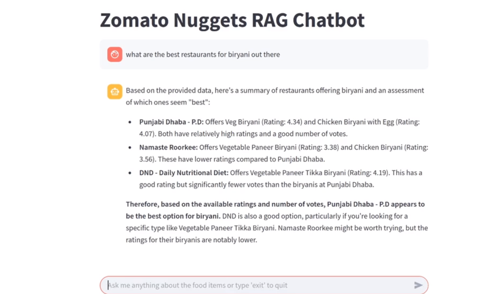

# Zomato Nuggets RAG Chatbot Project

## Overview
This project implements a chatbot that utilizes the Gemini model and various APIs to provide information about food items and restaurants. It integrates data scraping from Zomato and processes menu information to generate responses to user queries.


## Demo Video
[🎥 Watch demo video](/Zomato%20Nuggets%20Assingment%20Ansh%20Rastogi.mp4)

## How It Works
1. **Data Collection**: The project scrapes restaurant and menu data from Zomato using the `process_all_menus.py` script. This script extracts relevant information from JSON files and generates text blobs that summarize the menu items.

2. **Embedding Creation**: The chatbot uses the `SentenceTransformer` model to create embeddings for the text blobs. These embeddings are indexed using FAISS, allowing for efficient similarity searches.

3. **User Interaction**: The chatbot interface is built with Streamlit. Users can input their queries about food items, and the chatbot captures this input.

4. **Query Processing**: When a user submits a question, the chatbot encodes the query into an embedding and searches the FAISS index for the most relevant text blobs. It retrieves the top context chunks to provide a basis for generating a response.

5. **Response Generation**: The chatbot constructs a prompt using the retrieved context and the user's question. It then uses the Gemini model to generate a coherent answer based on the provided context.

6. **Display Results**: The generated response is displayed in the Streamlit interface, allowing users to interact with the chatbot seamlessly.

## Features
- **Chatbot Interface**: Built using Streamlit for user interaction.
- **Data Scraping**: Retrieves restaurant and menu data from Zomato.
- **Text Generation**: Uses the Gemini model for generating responses based on user queries.
- **Embedding and Search**: Implements a RAG (Retrieval-Augmented Generation) approach to answer questions using context from scraped data.

## Project Structure
```
├── app.py # Main application file for the chatbot
├── process_all_menus.py # Script for processing menu JSON files into text blobs
├── location.py # Module for retrieving user location based on IP
└── restaurant_data/ # Directory for storing scraped restaurant data
└── menus/ # Directory for storing menu JSON files
└── text_blobs/ # Directory for storing processed text blobs
```
## Requirements
- Python 3.x
- Required libraries:
  - `faiss`
  - `torch`
  - `sentence-transformers`
  - `transformers`
  - `google-generativeai`
  - `streamlit`
  - `requests`

You can install the required libraries using pip:
```bash
pip install -r requirements.txt
```

## Usage
1. **Set Up API Key**: Configure your API key for Gemini in `app.py`.
2. **Run the Application**: Start the Streamlit application by running:
   ```bash
   streamlit run app.py
   ```
3. **Interact with the Chatbot**: Open the provided URL in your browser to start chatting with the bot.

## Contributing
Feel free to fork the repository and submit pull requests for any improvements or features you would like to add.

## License
This project is licensed under the MIT License - see the [LICENSE](LICENSE) file for details.